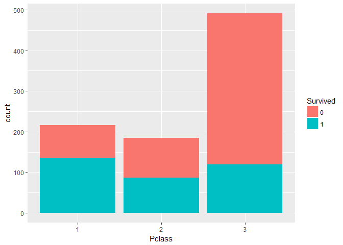

Titanic survival prediction
================
Eliza Norden, Alex Moellers, Sarah Catherine James
11 april 2018

Read data and typecast relevant variables
=========================================

``` r
library(rpart)
library(rpart.plot)
```

    ## Warning: package 'rpart.plot' was built under R version 3.4.4

``` r
library(RColorBrewer)
library(ggplot2)
library(randomForest)
```

    ## Warning: package 'randomForest' was built under R version 3.4.4

    ## randomForest 4.6-14

    ## Type rfNews() to see new features/changes/bug fixes.

    ## 
    ## Attaching package: 'randomForest'

    ## The following object is masked from 'package:ggplot2':
    ## 
    ##     margin

``` r
train = read.csv("train.csv")
test = read.csv("test.csv")

# combine train and test data
test$Survived = rep("None",418)
alldata = rbind(train, test)
attach(alldata)
train$Pclass <- as.factor(train$Pclass)
train$Survived <- as.factor(train$Survived)
alldata$Survived <- as.factor(alldata$Survived)
alldata$Pclass <- as.factor(alldata$Pclass)
```

Visualize data
==============

``` r
table(alldata$Survived) # Much more people died than survived
```

    ## 
    ##    0    1 None 
    ##  549  342  418

``` r
table(alldata$Pclass)  # Second and First class have a similar amount of people, third has many. 
```

    ## 
    ##   1   2   3 
    ## 323 277 709

``` r
ggplot(data = train, aes(x = Pclass, fill = Survived )) + geom_histogram(stat = "count")
```

    ## Warning: Ignoring unknown parameters: binwidth, bins, pad



``` r
ggplot(data = train, aes(x = Sex, fill = Survived )) + geom_histogram(stat = "count")
```

    ## Warning: Ignoring unknown parameters: binwidth, bins, pad

 In total, survival rate 62%. Most passengers onboard stayed in third class. We can see that these had a lower probability of surviving than people from the other classes. We also see a strong survival bias among females.

Feature extraction \#1 - titles
===============================

``` r
# Let us deal with the name feature
length(unique(as.character(alldata$Name)))  # Are there some names occurring two times?
```

    ## [1] 1307

``` r
double.names <- as.character(alldata[which(duplicated(as.character(alldata$Name))),"Name"])
double.names.entries <- alldata[which(as.character(alldata$Name) == double.names[1]|as.character(alldata$Name) == double.names[2]),]

# Some people seem to have the same name, but they are not the same person. 
# Now let us deal with the titles.

Title = sapply(Name, FUN = function(x) {strsplit(as.character(x), split='[,.]')[[1]][2]})
Title = substring(Title, 2)
alldata$Title = as.character(Title)

# That is a lot of titles, lets group them together.

alldata$Title[alldata$Title %in% c("Don", "Jonkheer")] = "Sir"
alldata$Title[alldata$Title %in% c("the Countess", "Lady", "Dona")] = "Lady"
alldata$Title[alldata$Title %in% c("Col", "Capt","Major")] = "Military"

# Let us not overfit, the seem to be the same as their sex and passenger class

alldata$Title[alldata$Title=="Mlle" | alldata$Title=="Ms"] = "Miss" # We are assuming here that all Ms are unmarried.
alldata$Title[alldata$Title=="Mme"] = "Mrs"

ggplot(data = alldata[1:891,], aes(x= Title, fill = Survived)) + geom_histogram(stat = "count")
```

    ## Warning: Ignoring unknown parameters: binwidth, bins, pad


``` r
# Let us not overfit, they seem to be the same as their sex and passenger class

ind_Tit_F = which(alldata$Title =="Lady")
alldata$Title[ind_Tit_F] = "Mrs"

ind_Tit_Male = which(alldata$Title =="Rev"|alldata$Title =="Military"|alldata$Title =="Dr"|alldata$Title =="Sir")
alldata$Title[ind_Tit_Male] = "Mr"

alldata$Title = as.factor(alldata$Title)

# Do these titles hold any predicitve power?
ggplot(data = alldata[1:891,], aes(x= Title, fill = Survived)) + geom_histogram(stat = "count")
```

    ## Warning: Ignoring unknown parameters: binwidth, bins, pad


``` r
# Now let us make the plot again and also include the Pclass.
ggplot(data = alldata[1:891,], aes(x= Title, fill = Survived)) + geom_histogram(stat = "count", binwidth = 0.6) + facet_wrap("Pclass")
```

    ## Warning: Ignoring unknown parameters: binwidth, bins, pad


Feature extraction \#2 - family size
====================================

``` r
# Let us turn to the sibspa variable. There is seven different levels of this variable. We will convert it into a factor and take a look at its predictive power.

ggplot(alldata[1:891,], aes(x = as.factor(SibSp), fill = Survived)) + geom_histogram(stat= "count", binwidth = 0.6) + facet_wrap(~Pclass+Title)
```

    ## Warning: Ignoring unknown parameters: binwidth, bins, pad


``` r
# We note that travelling with fewer people increases the survival rate in some cases. Especially for Master and Miss. To be able to take this into account, we create a family size variable. 

temp.sibsp <- c(train$SibSp, test$SibSp)
temp.parch <- c(train$Parch, test$Parch)
alldata$FamSize <- as.factor(temp.sibsp+temp.parch+1)

ggplot(alldata[1:891,], aes(x = FamSize, fill = Survived)) + geom_histogram(stat= "count", binwidth = 0.6) + facet_wrap(~Pclass+Title)
```

    ## Warning: Ignoring unknown parameters: binwidth, bins, pad

 Passengers holding the title Mr seem to be likely to die, regardless of passenger class, numbers of siblings/spouses or total family size. However, first class Mr's traveling with a small family seems to have improved survival rate over solo travelers and big families.

Feature extraction \#3 - boat decks and individual passenger fares
==================================================================

``` r
# create decks
alldata$Deck = substring(Cabin, 1, 1)
alldata$Deck[alldata$Deck==""] = "U" #unknown
alldata$Deck = as.factor(alldata$Deck)

ggplot(data = alldata,aes(x=as.factor(alldata$Survived), fill=alldata$Title)) + geom_bar(stat="count") 
```


``` r
#alldata$FamSize = as.factor(alldata$SibSp + alldata$Parch)
alldata$FamSize = alldata$SibSp + alldata$Parch

# Fare previous for the whole ticket. Divide it by number of passengers per ticket to get fare per passenger. 
# Travel size defined by number of passengers sharing same ticket number. Similar to FamSize but takes friend groups into account
alldata$FareAdj = rep("", dim(alldata)[1])
alldata$TravelSize = (rep(1, dim(alldata)[1]))
for(ticnr in levels(Ticket)) {
  alldata$FareAdj[alldata$Ticket==ticnr] = signif(alldata$Fare[(alldata$Ticket==ticnr)]/sum(alldata$Ticket==ticnr),4)
  alldata$TravelSize[(alldata$Ticket==ticnr)] =(sum(alldata$Ticket==ticnr))
}

alldata$FareAdj = as.numeric(alldata$FareAdj)
```

Fare adjusted for each passenger should be a better predictor than total ticket fare, since the fare data is more consistent. Instead, the size of the traveling company has been captured in its own variable.

Data imputation
===============

``` r
summary(alldata)
```

    ##   PassengerId   Survived   Pclass                                Name     
    ##  Min.   :   1   0   :549   1:323   Connolly, Miss. Kate            :   2  
    ##  1st Qu.: 328   1   :342   2:277   Kelly, Mr. James                :   2  
    ##  Median : 655   None:418   3:709   Abbing, Mr. Anthony             :   1  
    ##  Mean   : 655                      Abbott, Mr. Rossmore Edward     :   1  
    ##  3rd Qu.: 982                      Abbott, Mrs. Stanton (Rosa Hunt):   1  
    ##  Max.   :1309                      Abelson, Mr. Samuel             :   1  
    ##                                    (Other)                         :1301  
    ##      Sex           Age            SibSp            Parch      
    ##  female:466   Min.   : 0.17   Min.   :0.0000   Min.   :0.000  
    ##  male  :843   1st Qu.:21.00   1st Qu.:0.0000   1st Qu.:0.000  
    ##               Median :28.00   Median :0.0000   Median :0.000  
    ##               Mean   :29.88   Mean   :0.4989   Mean   :0.385  
    ##               3rd Qu.:39.00   3rd Qu.:1.0000   3rd Qu.:0.000  
    ##               Max.   :80.00   Max.   :8.0000   Max.   :9.000  
    ##               NA's   :263                                     
    ##       Ticket          Fare                     Cabin      Embarked
    ##  CA. 2343:  11   Min.   :  0.000                  :1014    :  2   
    ##  1601    :   8   1st Qu.:  7.896   C23 C25 C27    :   6   C:270   
    ##  CA 2144 :   8   Median : 14.454   B57 B59 B63 B66:   5   Q:123   
    ##  3101295 :   7   Mean   : 33.295   G6             :   5   S:914   
    ##  347077  :   7   3rd Qu.: 31.275   B96 B98        :   4           
    ##  347082  :   7   Max.   :512.329   C22 C26        :   4           
    ##  (Other) :1261   NA's   :1         (Other)        : 271           
    ##     Title        FamSize             Deck         FareAdj      
    ##  Master: 61   Min.   : 0.0000   U      :1014   Min.   :  0.00  
    ##  Miss  :264   1st Qu.: 0.0000   C      :  94   1st Qu.:  7.55  
    ##  Mr    :783   Median : 0.0000   B      :  65   Median :  8.05  
    ##  Mrs   :201   Mean   : 0.8839   D      :  46   Mean   : 14.76  
    ##               3rd Qu.: 1.0000   E      :  41   3rd Qu.: 15.01  
    ##               Max.   :10.0000   A      :  22   Max.   :128.10  
    ##                                 (Other):  27   NA's   :1       
    ##    TravelSize    
    ##  Min.   : 1.000  
    ##  1st Qu.: 1.000  
    ##  Median : 1.000  
    ##  Mean   : 2.102  
    ##  3rd Qu.: 3.000  
    ##  Max.   :11.000  
    ## 

``` r
# One NA adjusted fare. Estimate it using a regression tree.
FareFit = rpart(FareAdj ~ Sex + Pclass + Title + Deck + Embarked + TravelSize + FamSize, data=alldata[!is.na(alldata$FareAdj),], method="anova")
alldata$FareAdj[is.na(alldata$FareAdj)] = predict(FareFit, newdata=alldata[is.na(alldata$FareAdj),])
# Fill in the corresponding ticket fare for completeness.
alldata$Fare[is.na(alldata$Fare)] = alldata$FareAdj[is.na(alldata$Fare)]

# 2 missing embarkation ports. Use FareAdj as predictor.
EmbarkedFit = rpart(Embarked ~ FareAdj, data=alldata[alldata$Embarked!="",], method="class", maxdepth=3)
alldata$Embarked[which(alldata$Embarked=="")] = predict(EmbarkedFit, newdata=alldata[alldata$Embarked=="",], type="class")

# 263 NA ages. Regression by random forest.
AgeFit = randomForest(Age ~ FareAdj + Title + FamSize, data=alldata[!is.na(alldata$Age),], importance=TRUE, ntrees=500)
alldata$Age[is.na(alldata$Age)] = round(predict(AgeFit, newdata=alldata[is.na(alldata$Age),]))
```

Model fit and prediction
========================

``` r
# Cross validation
library(ggplot2)
library(caret)
```

    ## Warning: package 'caret' was built under R version 3.4.4

    ## Loading required package: lattice

``` r
library(doSNOW)
```

    ## Warning: package 'doSNOW' was built under R version 3.4.4

    ## Loading required package: foreach

    ## Warning: package 'foreach' was built under R version 3.4.4

    ## Loading required package: iterators

    ## Loading required package: snow

``` r
library(e1071)

# Final choice of predictors
train.set.1 = alldata[1:891, c("Pclass", "Title","FareAdj","TravelSize")]
train.set.1$Title <- as.factor(train.set.1$Title)
rf.label <- as.factor(train$Survived)

set.seed(5000)
# Split data into folds for cross validation
cross.10 <- createMultiFolds(rf.label, k=3, times = 10)
ctrl.1 <- trainControl(method = "repeatedcv", number = 10, repeats = 10, index = cross.10)

set.seed(2100)
# Cross validation
cv.result.1 <- train(x = train.set.1, y = rf.label, method = "rf", tuneLength = 3, ntree = 1000, trControl = ctrl.1)
#this will take some time
cv.result.1
```

    ## Random Forest 
    ## 
    ## 891 samples
    ##   4 predictor
    ##   2 classes: '0', '1' 
    ## 
    ## No pre-processing
    ## Resampling: Cross-Validated (10 fold, repeated 10 times) 
    ## Summary of sample sizes: 594, 594, 594, 594, 594, 594, ... 
    ## Resampling results across tuning parameters:
    ## 
    ##   mtry  Accuracy   Kappa    
    ##   2     0.8337823  0.6375221
    ##   3     0.8324355  0.6397750
    ##   4     0.8268238  0.6288026
    ## 
    ## Accuracy was used to select the optimal model using the largest value.
    ## The final value used for the model was mtry = 2.

``` r
# Best model and number of sampled variables retrieved from cross validation
final.model = cv.result.1$finalModel
mtry = cv.result.1$bestTune

test.set = alldata[892:1309,  c("Pclass", "Title","FareAdj","TravelSize")]
pred = predict(final.model, test.set, mtry=mtry)

df = data.frame(PassengerId = alldata$PassengerId[892:1309], Survived = pred)
write.csv(df, "submit_cv.csv", row.names=FALSE)
```

The best random forest model uses 2 randomly sampled variables at each split. Predicted test accuracy is 0.833. The actual test accuracy, retrieved by prediction submission to the Kaggle competition, is 0.799.
